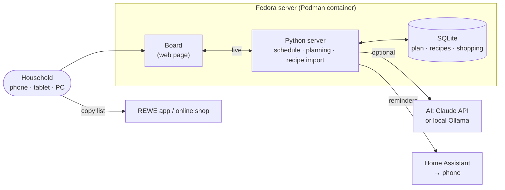

# Supper Board

**[English](#english) · [Deutsch](#deutsch)**

## English

A shared dinner board for the household, self-hosted on your own server. It shows what's for dinner tonight, a two-week meal plan with recipes, when to thaw something and the next shopping list. If you like, an AI (Claude or a local model via Ollama) writes new plans and learns from your ratings. Reminders reach your phone through Home Assistant.

Based on [weezerhunter/Supper-Board](https://github.com/weezerhunter/Supper-Board) (MIT license). The original ran as a Claude artifact with Walmart pickup orders in the US. This version is set up for Germany: the interface and recipes are in German, units are metric, everything runs on your own server, and the shopping list targets REWE (or any other supermarket). The guides in `docs/` are in German.

### Features

**Day to day, on phone, tablet or PC:**

- **Tonight:** today's dinner. Tap it for the recipe with ingredients to check off, numbered steps and a "keep screen on" button for cooking.
- **Two-week plan:** three cook nights a week by default, leftovers the next day, a flexible Sunday.
- **Thawing:** the evening before a meal with frozen meat, the board (and Home Assistant) reminds you to move it to the fridge.
- **Push back and swap:** move a meal and everything after it by 1–2 days (with undo), or swap two days. Thaw reminders move along.
- **Ratings and notes:** stars for each cook night, notes like "try with thinner spaghetti next time".
- **Shopping:** a shared list for extras, pantry staples marked "have" or "low" (low items join the list automatically), a freezer list.
- **Requests:** "more fish", "nothing elaborate the week of the 20th"; the next plan takes them into account.
- **Recipe database:** add your own recipes, import them from a link (Chefkoch, REWE, Lecker …), let the AI convert pasted text or invent a new recipe. Any recipe can be scheduled for a specific day. Meals rated 4–5 stars are added to the database automatically.
- **Metric:** recipes in g, ml, tbsp, tsp and °C with oven mode; imported imperial recipes are converted (with AI).

**Automatically, on a schedule:**

| When (default) | What happens | Board status |
|---|---|---|
| Daily | Cook, rate, add notes and items | active |
| Tuesday 6:50 | New plan for the next two weeks with recipes and shopping list | proposed |
| Tue–Thu | Review, mark meals to replace, **approve** | approved |
| Thursday 17:50 | Marked meals are replaced, the shopping list is finalized | list ready |
| Thu–Sat | **Copy list**, order in the REWE app or online shop, tap **bought** | bought |
| Saturday | Shopping, pickup or delivery; freeze week-2 meat | |
| Monday | The new plan is live | active |
| Daily 20:00 | Thaw reminder via Home Assistant if something needs thawing tomorrow | |

All days and times are configurable. The jobs always work from the plan's dates, so pushing the plan back shifts the whole cycle. Creating the next plan or the shopping list also works at the push of a button.

### How it works



- **Board** (`web/`): a web page that updates live whenever someone changes something. Can be added to the phone's home screen. No external fonts or scripts.
- **Server** (`app/`): Python (FastAPI) with an SQLite database. No cloud account needed.
- **AI** (optional): with `LLM_PROVIDER=claude`, requests, ratings, pantry and recipe titles go to the Anthropic API when planning. With `ollama`, everything stays on your network. With `none`, plans are built from your recipe database.
- **REWE:** REWE has no public ordering API, so the board produces a ready-to-paste list; each item in the plan's groceries also links to a search in the REWE online shop. Other supermarkets can be set in `.env`.

### Quick start

On the Fedora server:

```bash
git clone https://github.com/pinkie87/Supper-Board.git ~/supper-board
cd ~/supper-board
cp .env.example .env        # adjust settings, at least SB_PASSWORD
podman build -t localhost/supper-board:latest -f Containerfile .
podman run -d --name supper-board -p 8080:8080 --env-file .env -v supper-board-data:/data localhost/supper-board:latest
```

Then open `http://<server>:8080`. Running it as a systemd service, firewall, updates and backups are covered in [docs/einrichtung-fedora.md](docs/einrichtung-fedora.md). Further guides (in German): [Home Assistant](docs/home-assistant.md), [AI setup](docs/ki.md), [data model](docs/datenmodell.md), [kitchen tablet](docs/kuechen-tablet.md).

### Development

```bash
python3 -m venv .venv && . .venv/bin/activate
pip install -r requirements.txt pytest
python -m pytest
SB_DATA_DIR=./data uvicorn app.main:create_app --factory --reload --port 8080
```

### Limitations

- No automatic ordering at REWE (no public API); copy the list into the app or shop.
- Without AI there are no new recipes; plans then use only your recipe database.
- With Claude there are API costs, roughly 10–50 cents per plan depending on the model.
- Check AI-written plans and recipes against your allergies and food-safety habits.
- One shared password, no separate user accounts.
- The original's check of the last order via email (Gmail) is not included.

### License

MIT, see [LICENSE](LICENSE). Original project: [weezerhunter/Supper-Board](https://github.com/weezerhunter/Supper-Board).

---

## Deutsch

Ein gemeinsames Essens-Board für den Haushalt – selbst gehostet auf dem eigenen Server. Es zeigt, was es heute zum Abendessen gibt, den Speiseplan für zwei Wochen mit Rezepten, wann etwas aufgetaut werden muss und die nächste Einkaufsliste. Neue Pläne schreibt auf Wunsch eine KI (Claude oder ein lokales Modell über Ollama), die aus euren Bewertungen lernt. Erinnerungen kommen über Home Assistant aufs Handy.

Basiert auf [weezerhunter/Supper-Board](https://github.com/weezerhunter/Supper-Board) (MIT-Lizenz). Das Original lief als Claude-Artifact mit Walmart-Bestellung in den USA; diese Fassung ist auf Deutsch, metrisch, läuft komplett auf dem eigenen Server und kauft bei REWE (oder einem anderen Supermarkt) ein.

### Was es kann

**Im Alltag – auf Handy, Tablet oder PC:**

- **Heute Abend:** das heutige Gericht. Antippen öffnet das Rezept mit Zutaten zum Abhaken, Zubereitung und „Bildschirm anlassen“ fürs Kochen.
- **Zwei-Wochen-Plan:** standardmäßig drei Kochabende pro Woche, am Folgetag Reste, sonntags flexibel.
- **Auftauen:** Am Vorabend eines Gerichts mit Tiefkühlfleisch erinnert das Board (und Home Assistant): „Vor dem Schlafengehen: die Hähnchenbrust in den Kühlschrank.“
- **Verschieben und Tauschen:** Ein Gericht und alle folgenden um 1–2 Tage nach hinten schieben (mit Rückgängig) oder zwei Tage tauschen. Auftau-Erinnerungen wandern mit.
- **Bewerten und Notizen:** Sterne für jeden Kochabend, Notizen wie „nächstes Mal mit Spaghettini“.
- **Einkauf:** gemeinsame Liste für Zusätze, Grundvorrat mit „Da“/„Knapp“ (knapp kommt automatisch auf die Liste), Gefrierschrank-Liste.
- **Wünsche:** „mehr Fisch“, „in der Woche vom 20. nichts Aufwendiges“ – der nächste Plan berücksichtigt das.
- **Rezeptdatenbank:** eigene Rezepte anlegen, per Link importieren (Chefkoch, REWE, Lecker …), Text von der KI umwandeln lassen oder ein neues Rezept erfinden lassen. Jedes Rezept lässt sich direkt für einen Tag einplanen. Gut bewertete Gerichte (4–5 Sterne) aus den Plänen landen automatisch in der Datenbank.
- **Metrisch:** Rezepte in g, ml, EL, TL und °C mit Heizart; englische Rezepte werden beim Import umgerechnet (mit KI).

**Automatisch nach Zeitplan:**

| Wann (Standard) | Was passiert | Status im Board |
|---|---|---|
| Täglich | Kochen, bewerten, Notizen, Einkaufsliste ergänzen | aktiv |
| Dienstag 6:50 | Neuer Plan für die nächsten zwei Wochen mit Rezepten und Einkaufsliste | Vorschlag |
| Di–Do | Ansehen, Unpassendes auf „Ersetzen“ setzen, **Plan freigeben** | freigegeben |
| Donnerstag 17:50 | Markierte Gerichte werden ersetzt, Einkaufsliste wird fertiggestellt | Liste fertig |
| Do–Sa | **Liste kopieren**, in der REWE-App oder im Online-Shop bestellen, **Eingekauft** tippen | eingekauft |
| Samstag | Einkauf bzw. Abholung/Lieferung, Fleisch für Woche 2 einfrieren | |
| Montag | Der neue Plan ist aktiv | aktiv |
| Täglich 20:00 | Auftau-Erinnerung per Home Assistant, falls morgen etwas aufgetaut werden muss | |

Alle Tage und Uhrzeiten sind einstellbar. Die Aufgaben rechnen immer mit den Daten des Plans: Wird der Plan verschoben, verschiebt sich der ganze Ablauf mit. „Nächsten Plan jetzt erstellen“ und „Einkaufsliste jetzt erstellen“ gehen auch per Knopfdruck.

### Wie es aufgebaut ist


- **Board** (`web/`): eine Webseite, die sich live aktualisiert, sobald jemand etwas ändert. Lässt sich auf dem Handy zum Startbildschirm hinzufügen. Keine externen Schriften oder Skripte.
- **Server** (`app/`): Python (FastAPI) mit SQLite-Datenbank. Kein Cloud-Konto nötig.
- **KI** (optional): Mit `LLM_PROVIDER=claude` gehen beim Planen Wünsche, Bewertungen, Vorrat und Rezepttitel an die Anthropic-API. Mit `ollama` bleibt alles im Heimnetz. Mit `none` werden Pläne aus eurer Rezeptdatenbank zusammengestellt.
- **REWE:** REWE hat keine öffentliche Schnittstelle zum Bestellen. Das Board erstellt daher eine fertige Liste zum Kopieren; jeder Artikel im Plan-Einkauf ist außerdem ein Link auf die Suche im REWE-Shop. Andere Supermärkte lassen sich in der `.env` eintragen.

### Schnellstart

Auf dem Fedora-Server:

```bash
git clone https://github.com/pinkie87/Supper-Board.git ~/supper-board
cd ~/supper-board
cp .env.example .env        # Einstellungen anpassen, mindestens SB_PASSWORD
podman build -t localhost/supper-board:latest -f Containerfile .
podman run -d --name supper-board -p 8080:8080 --env-file .env -v supper-board-data:/data localhost/supper-board:latest
```

Dann `http://<server>:8080` öffnen. Für den Dauerbetrieb als systemd-Dienst, Firewall, Updates und Backups: **[docs/einrichtung-fedora.md](docs/einrichtung-fedora.md)**.

Weitere Anleitungen:

- [Home Assistant einbinden](docs/home-assistant.md) – Benachrichtigungen und ein Sensor „Heute Abend“
- [KI einrichten](docs/ki.md) – Claude oder Ollama
- [Datenmodell](docs/datenmodell.md) – alle Sammlungen und Felder
- [Küchen-Tablet](docs/kuechen-tablet.md) – Tablet-Ansicht, Vollbild, Kiosk-Modus

### Entwicklung

```bash
python3 -m venv .venv && . .venv/bin/activate
pip install -r requirements.txt pytest
python -m pytest
SB_DATA_DIR=./data uvicorn app.main:create_app --factory --reload --port 8080
```

### Grenzen

- Kein automatisches Bestellen bei REWE (keine öffentliche Schnittstelle) – Liste kopieren und in App oder Shop einfügen.
- Ohne KI gibt es keine neuen Rezepte; der Plan nutzt dann nur eure Rezeptdatenbank.
- Mit Claude fallen API-Kosten an, je nach Modell grob 10–50 Cent pro Plan.
- Pläne und Rezepte einer KI bitte auf Allergien und Lebensmittelsicherheit prüfen.
- Ein Passwort für alle; keine getrennten Benutzerkonten.
- Die Prüfung der letzten Bestellung per E-Mail (im Original über Gmail) gibt es hier nicht.

### Lizenz

MIT, siehe [LICENSE](LICENSE). Ursprüngliches Projekt: [weezerhunter/Supper-Board](https://github.com/weezerhunter/Supper-Board).