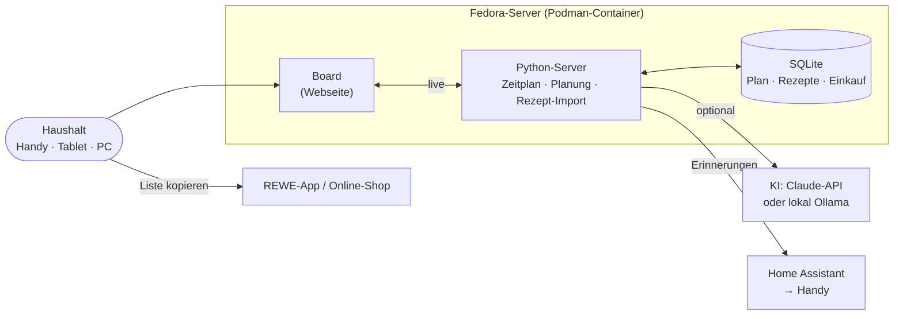

# Supper Board

**[English](#english) · [Deutsch](#deutsch)**

## English

A shared dinner board for the household, self-hosted on your own server. It shows what's for dinner tonight, a two-week meal plan with recipes, when to thaw something and the next shopping list. If you like, an AI (Claude or a local model via Ollama) writes new plans and learns from your ratings. Reminders reach your phone through Home Assistant.

Based on [weezerhunter/Supper-Board](https://github.com/weezerhunter/Supper-Board) (MIT license). The original ran as a Claude artifact with Walmart pickup orders in the US. This version is set up for Germany: the board can be switched between German and English, units are metric, everything runs on your own server, and the shopping list targets REWE (or any other supermarket). Detailed guides are available in English (`docs/en/`) and German (`docs/`).

### Features

**Day to day, on phone, tablet or PC:**

- **Tonight:** today's dinner. Tap it for the recipe with ingredients to check off, numbered steps and a "keep screen on" button for cooking.
- **Two-week plan:** three cook nights a week by default, leftovers the next day, a flexible Sunday.
- **Thawing:** the evening before a meal with frozen meat, the board (and Home Assistant) reminds you to move it to the fridge.
- **Push back and swap:** move a meal and everything after it by 1–2 days (with undo), or swap two days. Thaw reminders move along.
- **Ratings and notes:** stars for each cook night, notes like "try with thinner spaghetti next time".
- **Shopping:** a shared list for extras, pantry staples marked "have" or "low" (low items join the list automatically), a freezer list.
- **Requests:** "more fish", "nothing elaborate the week of the 20th"; the next plan takes them into account.
- **Recipe database:** add your own recipes, import them from a link (Chefkoch, REWE, Lecker …) or from **photos of a cookbook**, let the AI convert pasted text or invent a new recipe. Any recipe can be scheduled for a specific day. Meals rated 4–5 stars are added to the database automatically.
- **Metric:** recipes in g, ml, tbsp, tsp and °C with oven mode; imported imperial recipes are converted (with AI).
- **German or English:** switch the language in the board under "Feedback → Setup". It applies to the whole household, including notifications, shopping lists and new AI recipes.

**Automatically, on a schedule:**

| When (default) | What happens | Board status |
|---|---|---|
| Daily | Cook, rate, add notes and items | active |
| Tuesday 6:50 | New plan for the next two weeks with recipes and shopping list | proposed |
| Tue–Thu | Review, mark meals to replace, **approve** | approved |
| Thursday 17:50 | Marked meals are replaced, the shopping list is finalized | list ready |
| Thu–Sat | **Copy list**, order in the REWE app or online shop, tap **bought** | bought |
| Saturday | Shopping, pickup or delivery; freeze week-2 meat | |
| Monday | The new plan is live | active |
| Daily 20:00 | Thaw reminder via Home Assistant if something needs thawing tomorrow | |

All days and times are configurable. The jobs always work from the plan's dates, so pushing the plan back shifts the whole cycle. Creating the next plan or the shopping list also works at the push of a button.

### How it works


- **Board** (`web/`): a web page that updates live whenever someone changes something. Can be added to the phone's home screen. No external fonts or scripts.
- **Server** (`app/`): Python (FastAPI) with an SQLite database. No cloud account needed.
- **AI** (optional): with `LLM_PROVIDER=claude`, requests, ratings, pantry and recipe titles go to the Anthropic API when planning. With `ollama` or `openai` (a local OpenAI-compatible server such as llama.cpp), everything stays on your network – the model can also run on your PC. With `none`, plans are built from your recipe database.
- **REWE:** REWE has no public ordering API, so the board produces a ready-to-paste list; each item in the plan's groceries also links to a search in the REWE online shop. Other supermarkets can be set in `.env`.

### Installation on a Fedora server

Run these steps on the server as a regular user, not as root. Other Linux distributions with Podman or Docker work the same way; only the package installation differs.

**1. Install the tools**

```bash
sudo dnf install -y podman git
```

**2. Get the project and configure it**

```bash
git clone https://github.com/pinkie87/Supper-Board.git ~/supper-board
cd ~/supper-board
cp .env.example .env
nano .env
```

Set at least these values in `.env`:

- `SB_PASSWORD` – a password for the board (the browser asks once; any user name works)
- `SB_PUBLIC_URL` – the server's address, e.g. `http://192.168.1.50:8080`
- `LLM_PROVIDER` – start with `none`; later `claude` (plus `ANTHROPIC_API_KEY`) or `ollama`, see [docs/en/ai.md](docs/en/ai.md)
- Leave the Home Assistant settings empty for now; see [docs/en/home-assistant.md](docs/en/home-assistant.md)
- Using a store other than REWE: change `SB_STORE_NAME`, `SB_STORE_URL` and `SB_STORE_SEARCH_URL`
- `SB_LANGUAGE=en` starts the board in English (it can be switched in the board at any time)

**3. Build the container** (takes a few minutes the first time)

```bash
podman build -t localhost/supper-board:latest -f Containerfile .
```

**4. Set it up as a service that starts automatically**

```bash
mkdir -p ~/.config/containers/systemd
cp deploy/supper-board.container ~/.config/containers/systemd/
systemctl --user daemon-reload
systemctl --user start supper-board
sudo loginctl enable-linger $USER
```

The last command keeps the service running after a reboot, even when you're not logged in. The service reads its settings from `~/supper-board/.env`; if you cloned somewhere else, adjust `EnvironmentFile=` in the `.container` file.

**5. Open the firewall**

```bash
sudo firewall-cmd --permanent --add-port=8080/tcp
sudo firewall-cmd --reload
```

**6. Check that it runs**

```bash
systemctl --user status supper-board
curl http://localhost:8080/api/health
```

If you get `{"ok":true}`, open `http://<server-ip>:8080` on your phone, log in with the password and add the page to your home screen via the browser menu.

**7. First steps in the board**

1. Under "Feedback → Einrichtung", switch the language to English if you like (the board starts in German unless `SB_LANGUAGE=en`).
2. Under "Feedback", adjust the dietary guidelines.
3. Under "Recipes", add a few recipes (without AI, plans are built from them).
4. Under "Plan", tap "Create first plan".

**Updating**

```bash
cd ~/supper-board && git pull
podman build -t localhost/supper-board:latest -f Containerfile .
systemctl --user restart supper-board
```

**If something goes wrong:** `journalctl --user -u supper-board -f` shows the server log. If it says `Address already in use`, port 8080 is taken by another service; see [Port 8080 already in use](docs/en/setup-fedora.md#port-8080-already-in-use). Backups, compose instead of systemd and access from outside your home network are covered in [docs/en/setup-fedora.md](docs/en/setup-fedora.md). Further guides: [Home Assistant](docs/en/home-assistant.md), [AI setup](docs/en/ai.md), [data model](docs/en/data-model.md), [kitchen tablet](docs/en/kitchen-tablet.md).

### Development

```bash
python3 -m venv .venv && . .venv/bin/activate
pip install -r requirements.txt pytest
python -m pytest
SB_DATA_DIR=./data uvicorn app.main:create_app --factory --reload --port 8080
```

### Limitations

- No automatic ordering at REWE (no public API); copy the list into the app or shop.
- Without AI there are no new recipes; plans then use only your recipe database.
- With Claude there are API costs, roughly 10–50 cents per plan depending on the model.
- Check AI-written plans and recipes against your allergies and food-safety habits.
- One shared password, no separate user accounts.
- The original's check of the last order via email (Gmail) is not included.

### License

MIT, see [LICENSE](LICENSE). Original project: [weezerhunter/Supper-Board](https://github.com/weezerhunter/Supper-Board).

---

## Deutsch

Ein gemeinsames Essens-Board für den Haushalt – selbst gehostet auf dem eigenen Server. Es zeigt, was es heute zum Abendessen gibt, den Speiseplan für zwei Wochen mit Rezepten, wann etwas aufgetaut werden muss und die nächste Einkaufsliste. Neue Pläne schreibt auf Wunsch eine KI (Claude oder ein lokales Modell über Ollama), die aus euren Bewertungen lernt. Erinnerungen kommen über Home Assistant aufs Handy.

Basiert auf [weezerhunter/Supper-Board](https://github.com/weezerhunter/Supper-Board) (MIT-Lizenz). Das Original lief als Claude-Artifact mit Walmart-Bestellung in den USA; diese Fassung ist auf Deutsch, metrisch, läuft komplett auf dem eigenen Server und kauft bei REWE (oder einem anderen Supermarkt) ein.

### Was es kann

**Im Alltag – auf Handy, Tablet oder PC:**

- **Heute Abend:** das heutige Gericht. Antippen öffnet das Rezept mit Zutaten zum Abhaken, Zubereitung und „Bildschirm anlassen“ fürs Kochen.
- **Zwei-Wochen-Plan:** standardmäßig drei Kochabende pro Woche, am Folgetag Reste, sonntags flexibel.
- **Auftauen:** Am Vorabend eines Gerichts mit Tiefkühlfleisch erinnert das Board (und Home Assistant): „Vor dem Schlafengehen: die Hähnchenbrust in den Kühlschrank.“
- **Verschieben und Tauschen:** Ein Gericht und alle folgenden um 1–2 Tage nach hinten schieben (mit Rückgängig) oder zwei Tage tauschen. Auftau-Erinnerungen wandern mit.
- **Bewerten und Notizen:** Sterne für jeden Kochabend, Notizen wie „nächstes Mal mit Spaghettini“.
- **Einkauf:** gemeinsame Liste für Zusätze, Grundvorrat mit „Da“/„Knapp“ (knapp kommt automatisch auf die Liste), Gefrierschrank-Liste.
- **Wünsche:** „mehr Fisch“, „in der Woche vom 20. nichts Aufwendiges“ – der nächste Plan berücksichtigt das.
- **Rezeptdatenbank:** eigene Rezepte anlegen, per Link (Chefkoch, REWE, Lecker …) oder von **Fotos eines Kochbuchs** importieren, Text von der KI umwandeln lassen oder ein neues Rezept erfinden lassen. Jedes Rezept lässt sich direkt für einen Tag einplanen. Gut bewertete Gerichte (4–5 Sterne) aus den Plänen landen automatisch in der Datenbank.
- **Metrisch:** Rezepte in g, ml, EL, TL und °C mit Heizart; englische Rezepte werden beim Import umgerechnet (mit KI).
- **Deutsch oder Englisch:** Die Sprache lässt sich im Board unter „Feedback → Einrichtung“ umschalten. Sie gilt für den ganzen Haushalt, auch für Benachrichtigungen, Einkaufslisten und neue KI-Rezepte.

**Automatisch nach Zeitplan:**

| Wann (Standard) | Was passiert | Status im Board |
|---|---|---|
| Täglich | Kochen, bewerten, Notizen, Einkaufsliste ergänzen | aktiv |
| Dienstag 6:50 | Neuer Plan für die nächsten zwei Wochen mit Rezepten und Einkaufsliste | Vorschlag |
| Di–Do | Ansehen, Unpassendes auf „Ersetzen“ setzen, **Plan freigeben** | freigegeben |
| Donnerstag 17:50 | Markierte Gerichte werden ersetzt, Einkaufsliste wird fertiggestellt | Liste fertig |
| Do–Sa | **Liste kopieren**, in der REWE-App oder im Online-Shop bestellen, **Eingekauft** tippen | eingekauft |
| Samstag | Einkauf bzw. Abholung/Lieferung, Fleisch für Woche 2 einfrieren | |
| Montag | Der neue Plan ist aktiv | aktiv |
| Täglich 20:00 | Auftau-Erinnerung per Home Assistant, falls morgen etwas aufgetaut werden muss | |

Alle Tage und Uhrzeiten sind einstellbar. Die Aufgaben rechnen immer mit den Daten des Plans: Wird der Plan verschoben, verschiebt sich der ganze Ablauf mit. „Nächsten Plan jetzt erstellen“ und „Einkaufsliste jetzt erstellen“ gehen auch per Knopfdruck.

### Wie es aufgebaut ist



- **Board** (`web/`): eine Webseite, die sich live aktualisiert, sobald jemand etwas ändert. Lässt sich auf dem Handy zum Startbildschirm hinzufügen. Keine externen Schriften oder Skripte.
- **Server** (`app/`): Python (FastAPI) mit SQLite-Datenbank. Kein Cloud-Konto nötig.
- **KI** (optional): Mit `LLM_PROVIDER=claude` gehen beim Planen Wünsche, Bewertungen, Vorrat und Rezepttitel an die Anthropic-API. Mit `ollama` oder `openai` (lokaler OpenAI-kompatibler Server wie llama.cpp) bleibt alles im Heimnetz – das Modell kann auch auf deinem PC laufen. Mit `none` werden Pläne aus eurer Rezeptdatenbank zusammengestellt.
- **REWE:** REWE hat keine öffentliche Schnittstelle zum Bestellen. Das Board erstellt daher eine fertige Liste zum Kopieren; jeder Artikel im Plan-Einkauf ist außerdem ein Link auf die Suche im REWE-Shop. Andere Supermärkte lassen sich in der `.env` eintragen.

### Installation auf einem Fedora-Server

Die Schritte auf dem Server als normaler Benutzer ausführen, nicht als root. Andere Linux-Distributionen mit Podman oder Docker funktionieren genauso, nur die Paketinstallation unterscheidet sich.

**1. Programme installieren**

```bash
sudo dnf install -y podman git
```

**2. Projekt holen und einstellen**

```bash
git clone https://github.com/pinkie87/Supper-Board.git ~/supper-board
cd ~/supper-board
cp .env.example .env
nano .env
```

In der `.env` mindestens diese Werte setzen:

- `SB_PASSWORD` – ein Passwort für das Board (der Browser fragt einmal danach, der Benutzername ist egal)
- `SB_PUBLIC_URL` – die Adresse des Servers, z. B. `http://192.168.1.50:8080`
- `LLM_PROVIDER` – zum Start `none`; später `claude` (mit `ANTHROPIC_API_KEY`) oder `ollama`, siehe [docs/ki.md](docs/ki.md)
- Home Assistant erst mal leer lassen, siehe [docs/home-assistant.md](docs/home-assistant.md)
- Anderer Supermarkt als REWE: `SB_STORE_NAME`, `SB_STORE_URL` und `SB_STORE_SEARCH_URL` anpassen
- `SB_LANGUAGE=en` startet das Board auf Englisch (umschalten geht jederzeit im Board)

**3. Container bauen** (dauert beim ersten Mal ein paar Minuten)

```bash
podman build -t localhost/supper-board:latest -f Containerfile .
```

**4. Als Dienst einrichten, der automatisch startet**

```bash
mkdir -p ~/.config/containers/systemd
cp deploy/supper-board.container ~/.config/containers/systemd/
systemctl --user daemon-reload
systemctl --user start supper-board
sudo loginctl enable-linger $USER
```

Der letzte Befehl sorgt dafür, dass der Dienst auch nach einem Neustart läuft, ohne dass jemand angemeldet ist. Der Dienst liest die Einstellungen aus `~/supper-board/.env`; liegt das Projekt woanders, `EnvironmentFile=` in der `.container`-Datei anpassen.

**5. Firewall öffnen**

```bash
sudo firewall-cmd --permanent --add-port=8080/tcp
sudo firewall-cmd --reload
```

**6. Prüfen, ob es läuft**

```bash
systemctl --user status supper-board
curl http://localhost:8080/api/health
```

Kommt `{"ok":true}` zurück, auf dem Handy `http://<Server-IP>:8080` öffnen, mit dem Passwort anmelden und über das Browser-Menü „Zum Startbildschirm hinzufügen“.

**7. Erste Schritte im Board**

1. Unter „Feedback → Einrichtung“ bei Bedarf die Sprache wählen (Deutsch oder Englisch).
2. Unter „Feedback“ die Ernährungsrichtlinien anpassen.
3. Unter „Rezepte“ ein paar Rezepte anlegen (ohne KI wird der Plan daraus erstellt).
4. Unter „Plan“ auf „Ersten Plan erstellen“ tippen.

**Aktualisieren**

```bash
cd ~/supper-board && git pull
podman build -t localhost/supper-board:latest -f Containerfile .
systemctl --user restart supper-board
```

**Wenn etwas nicht klappt:** `journalctl --user -u supper-board -f` zeigt die Meldungen des Servers. Steht dort `Address already in use`, belegt ein anderer Dienst Port 8080; siehe [Port 8080 schon belegt](docs/einrichtung-fedora.md#port-8080-schon-belegt). Datensicherung, compose statt systemd und Zugriff von unterwegs stehen in [docs/einrichtung-fedora.md](docs/einrichtung-fedora.md).

Weitere Anleitungen:

- [Home Assistant einbinden](docs/home-assistant.md) – Benachrichtigungen und ein Sensor „Heute Abend“
- [KI einrichten](docs/ki.md) – Claude oder Ollama
- [Datenmodell](docs/datenmodell.md) – alle Sammlungen und Felder
- [Küchen-Tablet](docs/kuechen-tablet.md) – Tablet-Ansicht, Vollbild, Kiosk-Modus

### Entwicklung

```bash
python3 -m venv .venv && . .venv/bin/activate
pip install -r requirements.txt pytest
python -m pytest
SB_DATA_DIR=./data uvicorn app.main:create_app --factory --reload --port 8080
```

### Grenzen

- Kein automatisches Bestellen bei REWE (keine öffentliche Schnittstelle) – Liste kopieren und in App oder Shop einfügen.
- Ohne KI gibt es keine neuen Rezepte; der Plan nutzt dann nur eure Rezeptdatenbank.
- Mit Claude fallen API-Kosten an, je nach Modell grob 10–50 Cent pro Plan.
- Pläne und Rezepte einer KI bitte auf Allergien und Lebensmittelsicherheit prüfen.
- Ein Passwort für alle; keine getrennten Benutzerkonten.
- Die Prüfung der letzten Bestellung per E-Mail (im Original über Gmail) gibt es hier nicht.

### Lizenz

MIT, siehe [LICENSE](LICENSE). Ursprüngliches Projekt: [weezerhunter/Supper-Board](https://github.com/weezerhunter/Supper-Board).