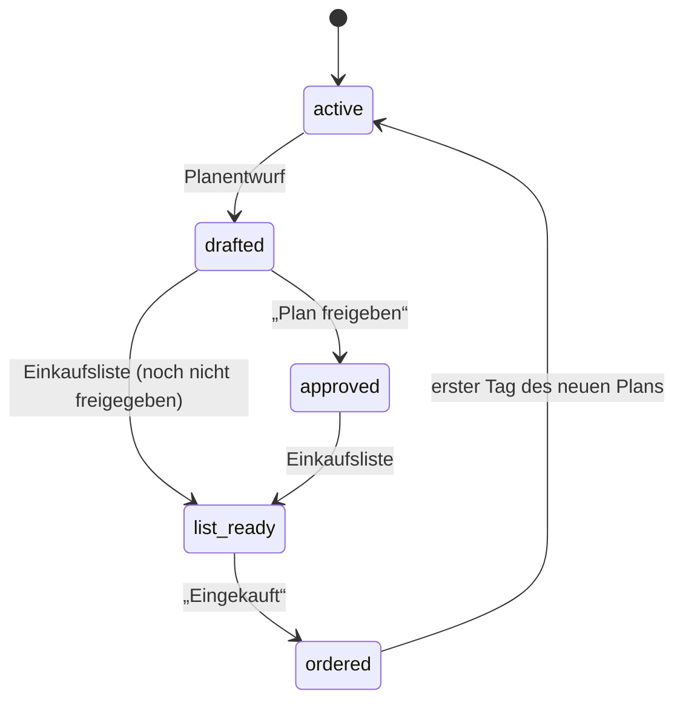

[English](en/data-model.md) · **Deutsch**

# Datenmodell

Alles liegt als JSON-Dokumente in Sammlungen in einer SQLite-Datei (`/data/supper-board.sqlite3` im Container). Board, Zeitplan und KI lesen und schreiben dieselben Dokumente. Datumsangaben sind lokale `JJJJ-MM-TT`-Texte.

Über die REST-Schnittstelle lässt sich alles auch von außen lesen und ändern:

| Aufruf | Wirkung |
|---|---|
| `GET /api/db/<sammlung>` | alle Dokumente einer Sammlung |
| `GET /api/db/<sammlung>/<id>` | ein Dokument |
| `POST /api/db/<sammlung>` | neues Dokument, Antwort `{"id": …}` |
| `PUT /api/db/<sammlung>/<id>` | Dokument ersetzen |
| `PATCH /api/db/<sammlung>/<id>` | Felder ändern; `{"feld": {"__delete__": true}}` löscht ein Feld |
| `DELETE /api/db/<sammlung>/<id>` | löschen |
| `GET /api/events` | Änderungen live (Server-Sent Events) |

## Sammlungen

### `meals` – der aktive Zwei-Wochen-Plan

Ein Dokument pro Abend.

| Feld | Typ | Bedeutung |
|---|---|---|
| `date` | Text | `2026-10-12` |
| `kind` | `"cook"` \| `"leftovers"` \| `"flex"` | Kochen, Reste, flexibel |
| `title` | Text | „Hähnchen-Curry mit Reis“ |
| `details` | Text | eine Zeile unter dem Titel |
| `recipe` | Objekt | `{serves, time, oven, ingredients: [], steps: [], tip}` |
| `recipeId` | Text | optional: Rezept in `recipes`, aus dem das Gericht stammt |
| `from` | Text | nur Reste: id des Kochabends |
| `thaw` | Text | optional: was am Vorabend aus dem Gefrierschrank muss |
| `thawDone` | bool | „Erledigt, liegt im Kühlschrank“ |
| `rating` | 0–5 | Sterne |
| `swapOut` | bool | nur im Entwurf: „Dieses Gericht ersetzen“ |

### `draft`
Der vorgeschlagene nächste Plan, gleiche Form wie `meals`. Wird zum aktiven Plan, sobald sein erster Tag erreicht ist.

### `history`
Vergangene Gerichte, damit Bewertungen über alle Pläne hinweg zählen.

### `recipes` – Rezeptdatenbank

| Feld | Bedeutung |
|---|---|
| `title`, `description` | Titel und Kurzbeschreibung |
| `serves`, `time`, `oven` | Portionen, Zeit („35 Min.“), Ofen („200 °C Umluft“) |
| `ingredients`, `steps` | Listen von Texten |
| `tip` | Tipp zur Aufbewahrung oder Variante |
| `tags` | Schlagworte |
| `source` | Link oder Herkunft („eigenes Rezept“, „KI-Plan“) |
| `createdAt` | Zeitpunkt |

Die Bewertung eines Rezepts ergibt sich aus allen Gerichten mit passender `recipeId`.

### Weitere

| Sammlung | Felder |
|---|---|
| `notes` | `{meal, text, at}` – Notiz zu einem Gericht |
| `ideas` | `{text, at}` – Wünsche für den nächsten Plan |
| `grocery` | `{text, at}` – Zusätze für den nächsten Einkauf |
| `staples` | `{name, group, status, order}` – Grundvorrat, `status`: `have`, `low` oder `unknown` |
| `freezer` | `{name, forMeal, at}` – Gefrierschrankinhalt |
| `imports` | `{state, images, recipes, message, order, createdAt}` – Foto-Import: `state` ist `waiting`, `working`, `done` oder `error`; `recipes` sind die erkannten, noch nicht geprüften Rezepte. Die Fotos liegen in `uploads/`. |

### `plan` (vier Dokumente)

**`plan/current`**

| Feld | Bedeutung |
|---|---|
| `start`, `end` | Zeitraum des aktiven Plans |
| `guidelines` | Ernährungsrichtlinien, bei jedem Plan berücksichtigt |
| `status` | `active` → `drafted` → `approved` → `list_ready` → `ordered` |
| `pickup` | Einkaufstag, z. B. „Sa. 17.10.“ |
| `statusNote` | Hinweis im Banner, z. B. „31 Artikel.“ |

**`plan/draft`**

| Feld | Bedeutung |
|---|---|
| `start`, `end`, `pickup`, `shopDate` | Zeitraum und Einkauf des nächsten Plans |
| `summary`, `prep` | Was neu ist; „Bei Ankunft einfrieren: …“ |
| `groceries` | `[{section, items: []}]` |
| `orderText` | fertige Einkaufsliste zum Kopieren |
| `included` | `{grocery: [ids], staples: [ids]}` – wird bei „Eingekauft“ abgehakt |

**`plan/job`** – Stand der gerade laufenden Aufgabe: `{name, state: "running"|"done"|"error", message}`.

**`plan/settings`** – Einstellungen des Haushalts: `{language: "de"|"en"}`. Fehlt, bis jemand die Sprache umschaltet; bis dahin gilt `SB_LANGUAGE`.

## Ablauf der Status

