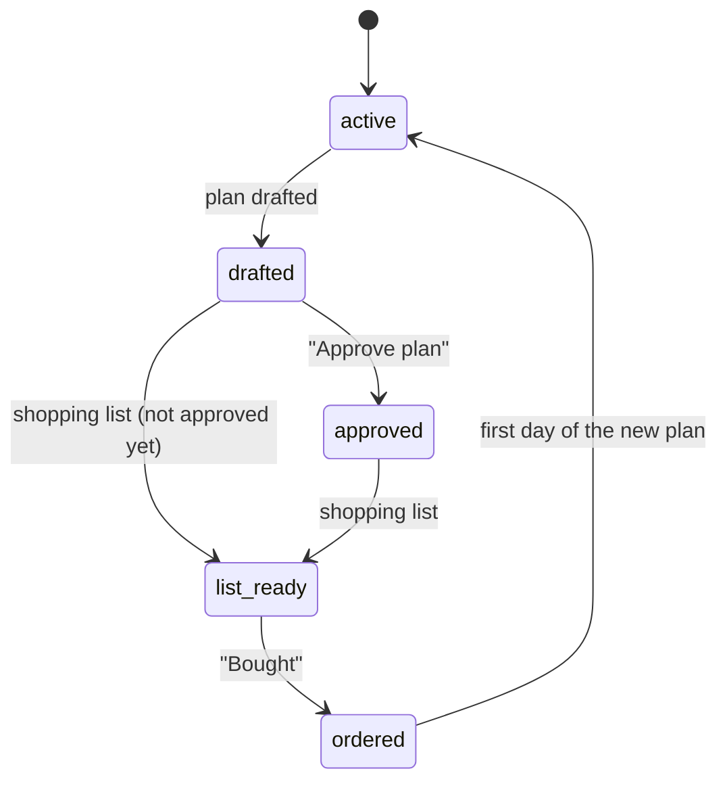

**English** · [Deutsch](../datenmodell.md)

# Data model

Everything is stored as JSON documents in collections inside one SQLite file (`/data/supper-board.sqlite3` in the container). The board, the scheduler and the AI read and write the same documents. Dates are local `YYYY-MM-DD` strings.

You can read and change everything through the REST API:

| Call | Effect |
|---|---|
| `GET /api/db/<collection>` | all documents in a collection |
| `GET /api/db/<collection>/<id>` | one document |
| `POST /api/db/<collection>` | new document, response `{"id": …}` |
| `PUT /api/db/<collection>/<id>` | replace a document |
| `PATCH /api/db/<collection>/<id>` | change fields; `{"field": {"__delete__": true}}` removes a field |
| `DELETE /api/db/<collection>/<id>` | delete |
| `GET /api/events` | live changes (server-sent events) |

## Collections

### `meals` – the live two-week plan

One document per night.

| Field | Type | Meaning |
|---|---|---|
| `date` | string | `2026-10-12` |
| `kind` | `"cook"` \| `"leftovers"` \| `"flex"` | cook night, leftovers, flexible |
| `title` | string | "Hähnchen-Curry mit Reis" |
| `details` | string | one line under the title |
| `recipe` | object | `{serves, time, oven, ingredients: [], steps: [], tip}` |
| `recipeId` | string | optional: the recipe in `recipes` this meal comes from |
| `from` | string | leftovers only: id of the cook night |
| `thaw` | string | optional: what to take out of the freezer the evening before |
| `thawDone` | bool | "done, it's in the fridge" |
| `rating` | 0–5 | stars |
| `swapOut` | bool | draft only: "replace this meal" |

### `draft`
The proposed next plan, same shape as `meals`. It becomes the live plan once its first day arrives.

### `history`
Past meals, so ratings count across all plans.

### `recipes` – recipe database

| Field | Meaning |
|---|---|
| `title`, `description` | title and short description |
| `serves`, `time`, `oven` | servings, time ("35 Min."), oven ("200 °C Umluft") |
| `ingredients`, `steps` | lists of strings |
| `tip` | storage tip or variation |
| `tags` | keywords |
| `source` | link or origin ("eigenes Rezept", "KI-Plan") |
| `createdAt` | timestamp |
| `version`, `versionNote`, `updatedAt` | version number, note on the last change, timestamp – set by the server on save |

A recipe's rating is derived from all meals with a matching `recipeId`.

### Others

| Collection | Fields |
|---|---|
| `notes` | `{meal, text, at}` – note on a meal |
| `ideas` | `{text, at}` – requests for the next plan |
| `grocery` | `{text, at}` – extras for the next shop |
| `staples` | `{name, group, status, order}` – pantry, `status`: `have`, `low` or `unknown` |
| `freezer` | `{name, forMeal, at}` – freezer contents |
| `imports` | `{state, images, recipes, message, order, createdAt}` – photo import: `state` is `waiting`, `working`, `done` or `error`; `recipes` are the recipes found but not yet reviewed. The photos are stored in `uploads/`. |
| `recipe_versions` | `{recipe, version, note, at, data}` – earlier versions of a recipe (`data` = recipe fields), at most 30 per recipe |

### `plan` (four documents)

**`plan/current`**

| Field | Meaning |
|---|---|
| `start`, `end` | range of the live plan |
| `guidelines` | dietary guidelines, used for every plan |
| `status` | `active` → `drafted` → `approved` → `list_ready` → `ordered` |
| `pickup` | shopping day, e.g. "Sa. 17.10." |
| `statusNote` | note in the banner, e.g. "31 Artikel." |

**`plan/draft`**

| Field | Meaning |
|---|---|
| `start`, `end`, `pickup`, `shopDate` | range and shopping day of the next plan |
| `summary`, `prep` | what's new; "freeze on arrival: …" |
| `groceries` | `[{section, items: []}]` |
| `orderText` | finished shopping list to copy |
| `included` | `{grocery: [ids], staples: [ids]}` – cleared when you tap "Bought" |

**`plan/job`** – state of the currently running job: `{name, state: "running"|"done"|"error", message}`.

**`plan/settings`** – household settings: `{language: "de"|"en"}`. Missing until someone switches the language; until then `SB_LANGUAGE` applies.

## Status flow

